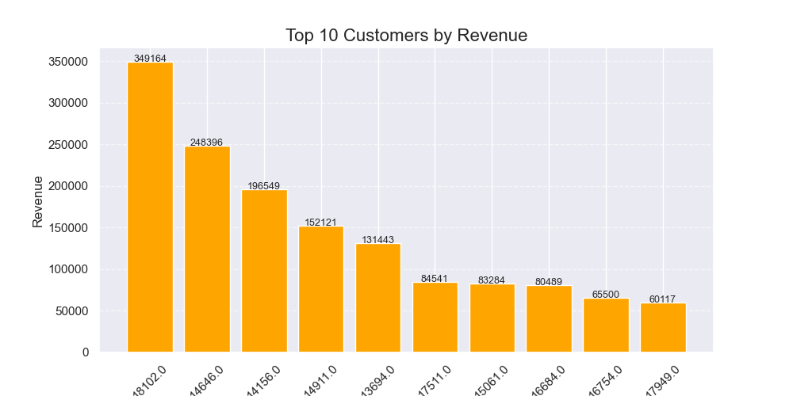
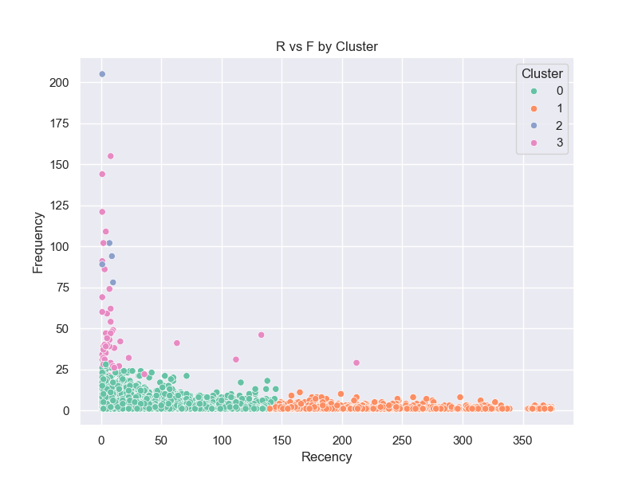
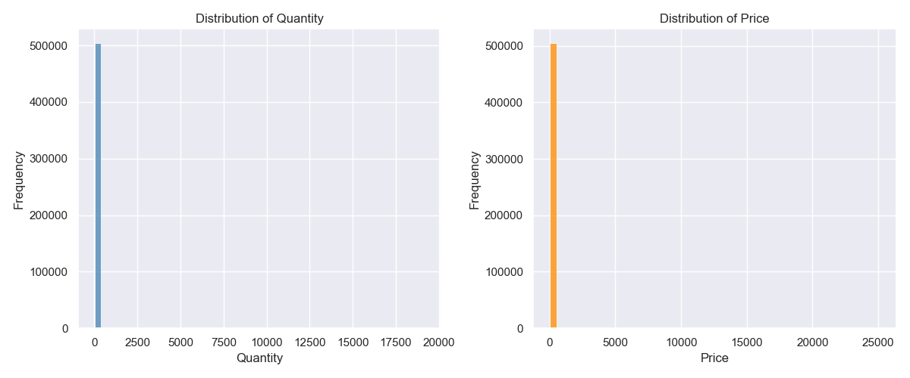
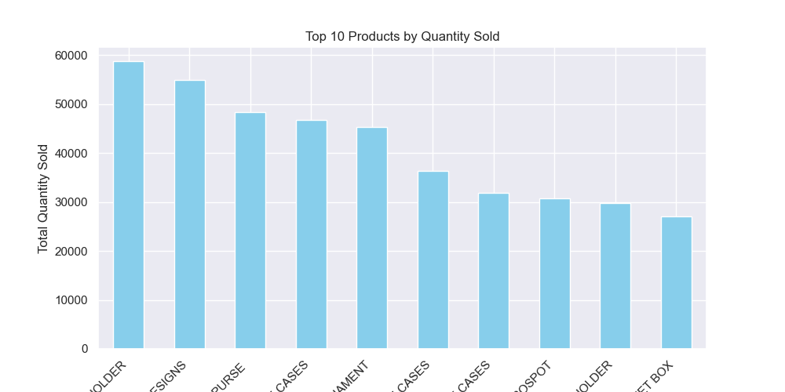

**Customer Segmentation & E-commerce Insights**

This repository contains an end-to-end project on customer segmentation and e-commerce insights.
It includes:

Jupyter Notebook – Exploratory Data Analysis (EDA), Pareto principle insights, RFM analysis, and visualizations.

Streamlit App (main.py) – An interactive app that applies RFM-based clustering (KMeans) and visualizes customer groups with recommendations.

The goal is to understand customer behavior, identify high-value customers, and provide actionable insights for marketing and business strategy.

**Project Highlights**

Exploratory Analysis – Product price distribution, top-selling items, and customer revenue contribution.

Pareto Analysis (80/20 Rule) – Understanding how much revenue comes from top 20% customers.

RFM Analysis – Profiling customers by Recency, Frequency, and Monetary value.

KMeans Clustering – Segmenting customers into groups for better targeting.

Streamlit Interface – Simple UI for viewing clusters, profiles, and recommendations.

**Tech Stack**

Python 3

Pandas, NumPy – Data processing

Matplotlib, Seaborn – Visualizations

Scikit-learn – Scaling, clustering, PCA

Streamlit – Interactive app

**How to Run**
1. Run the Notebook
jupyter notebook "Customer Segmentation & E-commerce Insights.ipynb"

2. Run the Streamlit App
streamlit run main.py

**Sample Visuals**

1. Customer Revenue Contribution

2. RFM Clusters (KMeans Segmentation)

3. UK vs Other Countries Revenue
[UK vs Other](Images/Uk_vs_other.png)

4. Price & Quantity Distribution

5. Product Distribution

**Business Recommendations**

Champions (Low Recency, High Frequency & High Monetary) → Reward with loyalty perks.

At Risk (High Recency, Low Frequency) → Target with win-back campaigns.

Loyal (High Frequency, Medium Monetary) → Good for upselling and cross-selling.

Casual/New Customers (Low Frequency, Low Monetary) → Engagement emails and first-purchase offers.
